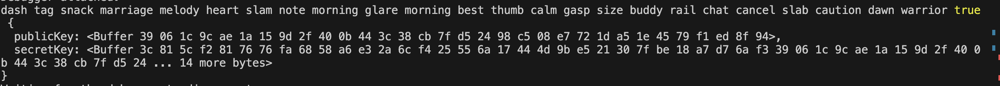
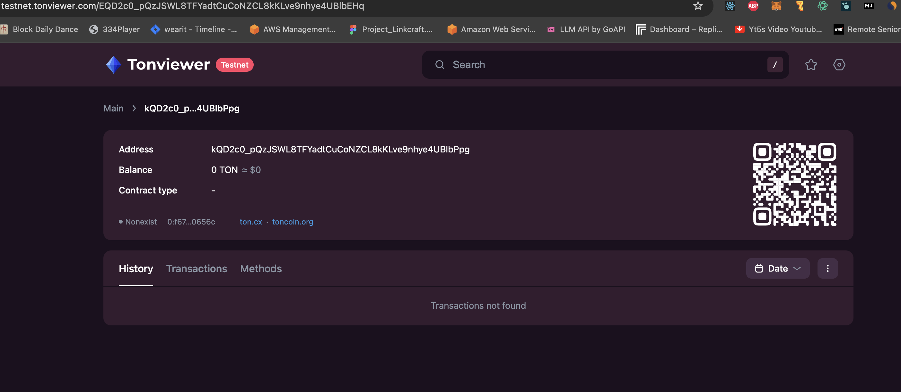
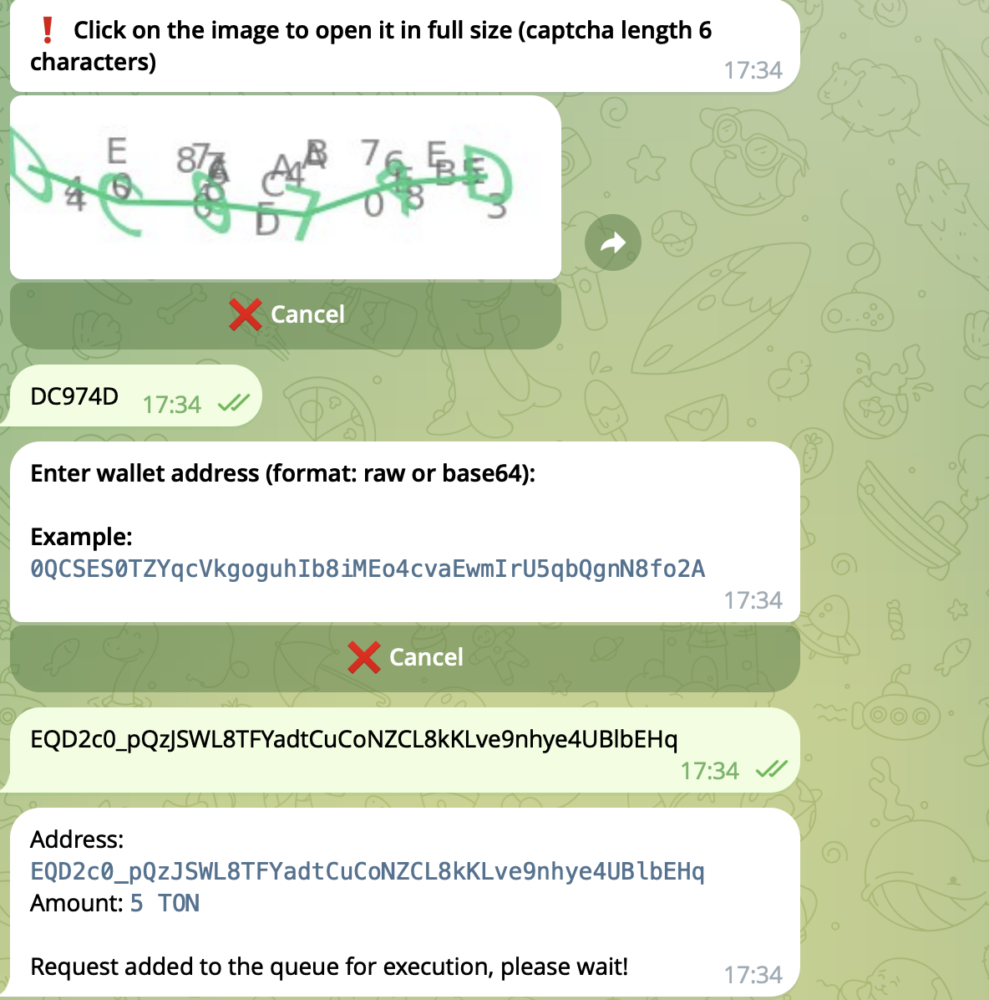
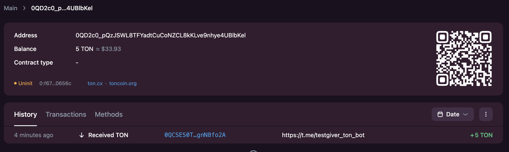
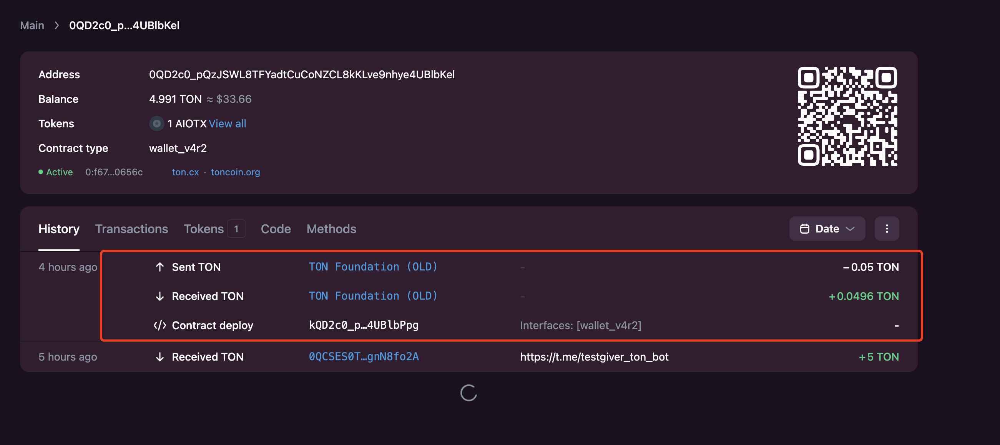
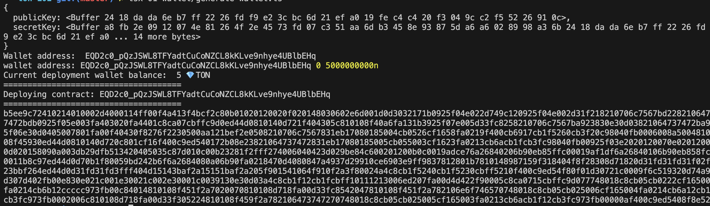

# wallet

TON 不存在 EOA 钱包！
TON 不存在 EOA 钱包！
TON 不存在 EOA 钱包！
所有的钱包都是合约钱包账户。

## generate mnemonics

生成带有密码的助记词，这样即使泄露了助记词，其他人如果不知道密码的情况下，也很难得到私钥，安全性上更高一点。但是无论如何助记词都不应该被泄露，切记～

```typescript
const password: string | null | undefined = "1234567890";
// generate mnemonics
const mnemonics: string[] = await mnemonicNew(24, password);
const mnemonicsValid: boolean = await mnemonicValidate(mnemonics, password);
const keyPair: KeyPair = await mnemonicToPrivateKey(mnemonics, password);
console.log(mnemonics.join(" "), mnemonicsValid, keyPair);
```

我生成的助记词，`dash tag snack marriage melody heart slam note morning glare morning best thumb calm gasp size buddy rail chat cancel slab caution dawn warrior`，大家可以随便用我这个号，密码为 "1234567890"。


## deploy wallet contract

在 TON 里生成钱包，其实就是部署一个钱包合约，TON 官方目前稳定的版本是 V4(V5 已经在测试中)。

### TON Wallet Contract Versions

1. **v1R1 (Simple Wallet)**

   - 最基本的钱包合约
   - 只支持单个签名
   - 没有时间锁或其他高级功能

2. **v1R2**

   - 对 v1R1 的小幅改进
   - 增加了一些优化

3. **v2R1**

   - 引入了序列号(seqno)概念
   - 提高了安全性，防止重放攻击

4. **v2R2**

   - 进一步优化
   - 改进了 gas 费用处理

5. **v3R1**

   - 引入了时间锁功能
   - 允许设置交易的有效时间窗口

6. **v3R2**

   - 对 v3R1 的优化版本
   - 改进了代码效率

7. **v4R1**

   - 支持多重签名
   - 允许设置多个密钥和签名阈值

8. **v4R2**
   - v4R1 的优化版本
   - 进一步提高了效率和安全性

###

合约地址计算方式

# TON Contract Address Calculation Process

TON 合约地址的计算主要基于以下因素：

1. **初始代码（Initial Code）**
2. **初始数据（Initial Data）**
3. **工作链 ID（Workchain ID）**

计算步骤如下：

1. **创建状态初始化（State Init）**:

   - 将初始代码和初始数据组合成一个称为"状态初始化"的结构。

2. **序列化状态初始化**:

   - 将状态初始化结构序列化为字节序列。

3. **计算哈希值**:

   - 对序列化后的状态初始化计算 sha256 哈希。

4. **截取哈希值**:

   - 取哈希值的前 256 位（32 字节）作为账户 ID。

5. **组合地址**:

   - 将工作链 ID（通常为 0）和账户 ID 组合，形成完整的合约地址。

6. **可选：创建用户友好地址**:
   - 对完整地址进行 base64 编码，并添加校验和，创建用户友好的地址格式。

注意：实际实现可能更复杂，需要考虑 TL-B 编码等 TON 特定的细节。
因为钱包合约的代码是固定的，但是初始状态比如 publicKey, walletId, workchain 都是唯一的，所以钱包合约地址是可以提前计算出来的。

```typescript
const endpoint = await getHttpV4Endpoint({ network: "testnet" });
const client = new TonClient4({ endpoint });
// create wallet
const password: string | null | undefined = "12345678910";

const keyPair: KeyPair = await mnemonicToPrivateKey(
  process.env.MEME?.split(" ") || [],
  password
);
console.log(keyPair);

let workchain = 0;
let wallet_create = WalletContractV4.create({
  workchain,
  publicKey: keyPair.publicKey,
  walletId: 0,
});
let wallet = client.open(wallet_create);
console.log("Wallet address: ", wallet.address);
```


可以看到这个钱包是 inactive 的，因为他并没有部署到 ton 的链上。


### get facet

可以通过自己生成的钱包地址，去[官方测试网水龙头](https://t.me/testgiver_ton_bot)去领取 5 个 TON（可以用很久了）



### deploy wallet contract

发送一笔转账到 ton 官方的地址并带上 init state(code + data 的集合)，就会部署之前配置好钱包合约

```typescript
await wallet.sendTransfer({
  seqno,
  secretKey: keyPair.secretKey,
  messages: [
    internal({
      to: "EQCD39VS5jcptHL8vMjEXrzGaRcCVYto7HUn4bpAOg8xqB2N",
      value: toNano("0.05"),
      bounce: true,
      init: wallet_contract.init,
    }),
  ],
});
```




# wallet address

基本格式:
TON 地址通常由两部分组成:工作链 ID 和账户 ID,格式如下:
<workchain_id>:<account_id>
工作链 ID(Workchain ID):
代表工作链 ID（一个有符号的 32 位整数）
主网(mainnet) 上最常用的是 0

> TON 理论上是可以有 2^32 个不同的工作链，而且每个都可以独立技术架构，也许某个工作链可以采用 EVM 的架构，运行 solidity 的合约，所以 TON 在起初的设计上就为这种兼容性考虑。

账户 ID(Account ID):
**ton 不存在所谓的 EOA（外部账户），只存在合约钱包。**账户 ID (account_id) 被定义为智能合约对象的哈希函数（专指 SHA-256）。每个在 TON 区块链上运行的智能合约都存储两个主要组件。
这些包括：
编译后的代码。智能合约的逻辑以字节码形式编译。
初始 data。合约在链上部署时的值。
最后，为了准确地推导出合约的地址，需要计算与**（初始代码，初始 data）** 对象相对应的哈希。 account_id = hash（初始代码，初始 data）

## 原始地址的问题

原始地址形式存在两个主要问题：

1. 在使用原始地址格式时，无法在发送交易前验证地址以消除错误。 这意味着，如果您在发送交易前不小心在地址字符串中添加或删除字符，您的交易将被发送到错误的目的地，导致资金损失。
2. 在使用原始地址格式时，无法添加像使用用户友好地址时发送交易所用的特殊标志位。 为了帮助您更好地理解这个概念，我们将在下面解释可以使用哪些标志位。

## 用户友好格式:

为了便于使用,TON 还提供了一种更友好的地址格式,通常被称为"用户友好地址"。这种格式使用 Base64 编码,并添加了一些额外的信息:
<flags><workchain_id><account_id><crc16_checksum>

flags: 用于指示地址类型和格式的标志
[标志位 - 1 字节] — 附加到地址的标志位会改变智能合约对收到的消息的反应。 使用用户友好地址格式的标志位类型包括：
isBounceable。表示可弹回或不可弹回的地址类型。(0x11 表示“可弹回”，0x51 表示“不可弹回”)
isTestnetOnly。表示仅用于测试网的地址类型。以 0x80 开头的地址不应被生产网络上运行的软件接受
[workchain_id - 1 字节] — 工作链 ID (workchain_id) 由一个有符号的 8 位整数 workchain_id 定义。\ (0x00 表示基本链，0xff 表示主链)
[account_id - 32 字节] — 账户 ID 由工作链中的 256 位（大端序）地址组成。
[地址验证 - 2 字节] — 在用户友好地址中，地址验证由前 34 个字节的 CRC16 签名组成。(示例) 实际上，用户友好地址的验证思想与所有信用卡上使用的 Luhn 算法类似，以防止用户错误输入不存在的卡号。
这 4 个主要组件的总计 1 + 1 + 32 + 2 = 36 字节（每个用户友好地址）
要生成用户友好地址，开发者必须使用以下方式对所有 36 个字节进行编码：

base64（即数字、大小写拉丁字母、'/' 和 '+'）
base64url（用 '\_' 和 '-' 代替 '/' 和 '+'）
crc16_checksum: 用于验证地址有效性的校验和
具体生成和转换代码可见 `transform-address.ts`
